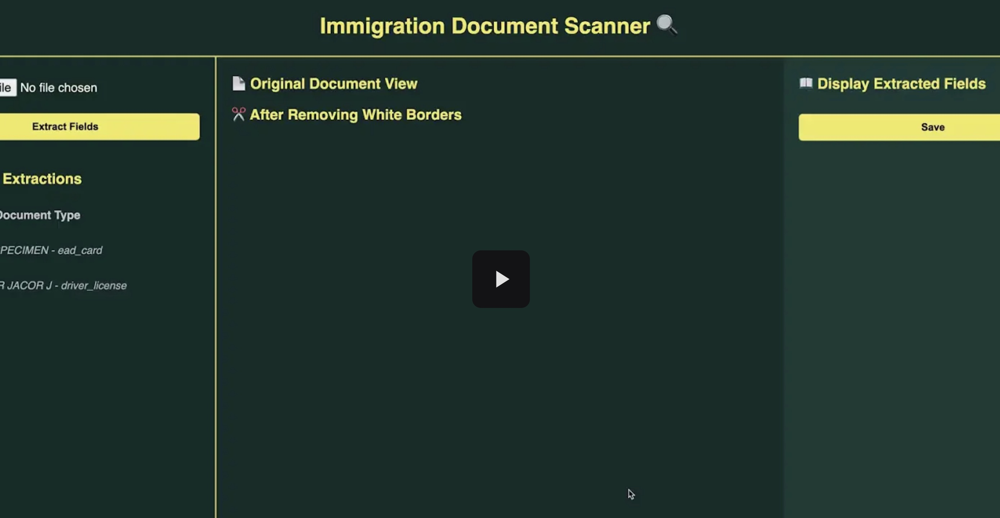

# Immigration Document Scanner – README

## Project Overview
This project is an immigration document scanner built with **FastAPI** (backend), **ReactJS + TypeScript** (frontend), and **SQLite** (database).

It detects key fields like name, birthdate, and document number from uploaded images.
Images are preprocessed to remove borders, resized to a known aspect ratio, and then parsed using pre-defined coordinates.
Dates and strings are cleaned using fuzzy matching.

## High Level graph


## Project demo video (just click on the picture)
[](https://drive.google.com/file/d/1tebQm4_q9hubX7PfJ9jn5EMgEaiM1fQm/view?usp=sharing)

## Note about details
- For detailed parts(testing, my decision making approach), please go to my pdf engineering doc: https://drive.google.com/file/d/1UO3vpCoNDYzWAydOsQujwcswOUZYmJF2/view?usp=sharing

## Frontend preview


## How to Run the Project

### Backend
- Go to the `backend` folder.
- Run the server with:
  ```bash
  uvicorn main:app --reload
  ```
- Open [http://127.0.0.1:8000/docs](http://127.0.0.1:8000/docs) to test the API.

### Frontend
- Go to the `frontend` folder.
- Install dependencies:
  ```bash
  npm install
  ```
- Start the frontend:
  ```bash
  npm run dev
  ```
- Open [http://localhost:3000/](http://localhost:3000/) to view the interface.

## Dependencies
All backend dependencies are listed in:
```
backend/environment.yml
```

## Features
- Document classification based on aspect ratio.
- Field extraction using OCR and region mapping.
- Clean date strings with fuzzy matching.
- Editable frontend interface with save functionality.
- SQLite database integration with unique record IDs.

## Endpoints Summary
- `POST /classify_and_extract`: Extract fields from the uploaded image.
- `POST /save`: Save or update extracted field values in the database.
- `GET /recent`: Get the 10 most recent records.
- `GET /debug_all`: Debug and view all records.

## Future Improvements
- Add support for more document types.
- Define new coordinate mappings for additional layouts.
- Improve error handling and input validation.
- Add automated tests.
